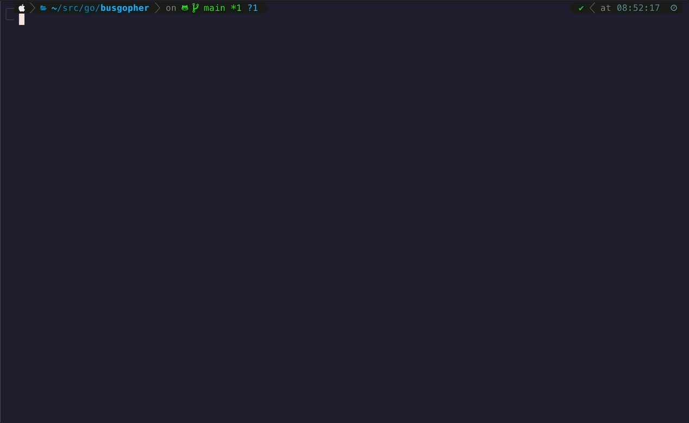

# BusGophe


## Azure Service Bus client made in the terminal for terminal

[](code_of_conduct.md)

## What problem BusGopher solves?

BusGopher is a simple cli tool that makes it easy to send messages to [Azure Service Bus](https://learn.microsoft.com/en-us/azure/service-bus-messaging/service-bus-messaging-overview). 

One of the potential applications is fast and straightforward service testing. You don't have to log in again and again to the Azure portal to send a message. Just prepare a template that may contain autogenerated fields and use BusGopher in CLI mode.

If you prefer, you may use GUI mode to select messages, connections, and destinations (queue/topics) in a more user-friendly manner. The following sections discuss usage.

## Usage

Busgopher may be run in two modes: CLI and GUI.

### CLI

The CLI mode is dedicated to running the tool fast without UI. To use CLI mode, run Busgopher with arguments that specify the connection, destination, and message. The connection, destination, and message are selected by providing their names.

```sh
./busgopher --msg="test-message" --conn="demo" --dest="test-queue"
```

Don't worry if you miss an argument or pass a wrong name. Busgopher will provide an error message. 

```sh
./busgopher --msg="unknown" --conn=dev --dest=test-queue
Started headless mode with connection: demo, destination: test-queue, message: unknown
[2024-10-08 20:04:37]: [Info] Selected connection: dev (demo.servicebus.windows.net)
[2024-10-08 20:04:37]: [Info] Selected destination: test-queue
[2024-10-08 20:04:37]: [Error] Can't find message with name: unknown
[2024-10-08 20:04:37]: [Error] Message not selected!
```

### GUI

The GUI mode provides a graphical interface for interacting with Busgohper. At the moment, it allows you to select from a config file configuration. You can navigate between panels via TAB, select options by arrows, and select them by ENTER.

You can preview the selected message body in the Preview section. The logs section provides diagnostic logs.



## Configuration

The main idea behind BusGopher is simplicity. The configuration is stored in a config.json file. You may edit the configuration file either using your editor of choice or the built-in editor (which validates the created JSON).

Having a separate configuration file promotes the tool's portability and sharing capabilities. You just need to send the config file to your colleague.

The BusGopher configuration is divided into two parts: connections & messages. 

### Connections

The first one configures the connection to Azure Service Bus (ASB). The connection uses [DefaultAzureCredentials](https://learn.microsoft.com/en-gb/dotnet/azure/sdk/authentication/credential-chains?tabs=dac#usage-guidance-for-defaultazurecredential) feature to authorize access to ASB.

Available properties:
- Name - user-friendly connection name. Will be used to select connection;
- Namespace - Azure Service Bus namespace;
- Destinations - list of available entities (both queues and topic) that may be selected to send a message to;

Sample connection section:

```json
"connections": {
    "test-connection": {
        "namespace": "test.azure.com",
        "destinations": [
            "queue",
            "topic"
        ]
    }
}
```

### Messages

The second part of the configuration—messages—defines messages that will be sent to ASB. We may define both built-in and custom message properties. More about properties is in the Features section.

Besides properties, users may define the message body. The message body has no structure limitations, but your ASB configuration in Azure limits the body length. You can benefit from the message template engine while defining the message body. More about the message body template engine is in the Features section.

Each message has to have a unique name, such as `test-message`. 

Sample message section:

```json
"messages": {
    "test-message": {
        "body": "{ test msg body }",
        "correlationId": "",
        "messageId": "",
        "replyTo": "",
        "subject": "",
        "customProperties": {
            "propA": "test"
        }
    }
}
```

### Sample config

```json
{
    "connections": {
        "test-connection": {
            "namespace": "test.azure.com",
            "destinations": [
                "queue",
                "topic"
            ]
        }
    },
    "messages": {
        "test-message": {
            "body": "{ test msg body }",
            "correlationId": "",
            "messageId": "",
            "replyTo": "",
            "subject": "",
            "customProperties": null
        }
    }
}
```

## Features

### Message body template engine

Bustopher provides a simple template engine that enables message body generation according to a defined template. The built-in template engine is based on the Golang [text/templates package](https://pkg.go.dev/text/template). Bustopher provides a set of predefined functions. 

To use the engine, embed a predefined function in the saved message body, like:

```json
    {
        "name": "Engine presentation",
        "body": "Random UUID: {{generateUUID}} generated at {{utcNow}} "
    },
```

#### Predefined functions

- utcNow
Gets current UTC now date time from machine and returns it in RFC333 format. Usage:
```
Message created at {{utcNow}}.

Message created at 2024-10-06T19:34:39Z.
```

- generateUUID
Generates random UUID. Usage:
```
This is random UUID: {{generateUUID}}.

This is random UUID: 69a17b86-68d7-4e59-bb2f-09b3590135c8.
```

### Message properties

Busgopher supports defining messages built in and custom properties that consumers may use. Supported built in properies are:
- CorrelationID
- MessageID
- ReplayTo
- Subject

To define messages' properties just define them in the messages.json file like:

```json
{
    "name": "Properties sample",
    "body": "Focus on properties please",
    "subject": "Custom subject",
    "replyTo": "def-null"
    "customProperties": { 
        "isCustom": "true" 
    }
}
```

## Your Feedback

Add your issue here on GitHub. Feel free to get in touch if you have any questions.

## Code of Conduct

This project has adopted the code of conduct defined by the [Contributor Covenant](https://www.contributor-covenant.org/) to clarify expected behavior in our community.

